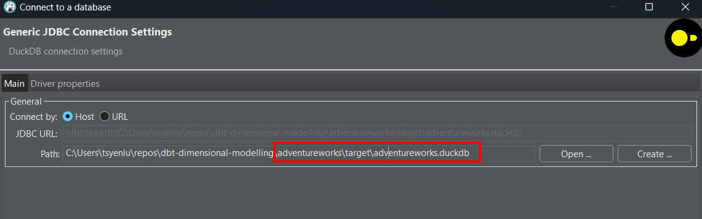

## Part 2: Our very first dbt commands

### Step 1: Setup dbt profile

Change into the dbt project folder, i.e. `adventureworks`:

```
cd adventureworks
```

The dbt profile (see `adventureworks/profiles.yml`) has already been pre-configured for you. Verify that the configurations are set correctly based on your database credentials: 

```yaml
adventureworks:
  target: duckdb # leave this as duckdb (default)
  outputs:
    duckdb: 
     type: duckdb
     path: target/adventureworks.duckdb
     threads: 12
```

### Step 2: Install dbt dependencies

We use packages like [dbt_utils](https://hub.getdbt.com/dbt-labs/dbt_utils/latest/) in this project, and we need to install the libraries for this package by running the command: 

```
dbt deps 
```
This command will install all dbt depencies for our dbt project.\
It looks in the `packages.yml` (and more specifically also the `package-lock.yml`) file to find the dependencies and installs them.

### Step 3: Seed your database

We are using [dbt seeds](https://docs.getdbt.com/docs/build/seeds) (see `adventureworks/seeds/*`) to insert AdventureWorks data into your database.

As you can see in the `adventureworks/seeds` folder, we have a seed .csv file for each table in the AdventureWorks database that we want to use.\
In the corresponding yml file, we add some configurations, like the schema where the data should be inserted.\
As you can see in the example below, we have a seed for the `productcategory` table that targets the `bronze_adventureworks` schema.

```yaml
version: 2 

seeds: 
  - name: productcategory
    config: 
      schema: bronze_adventureworks
      column_types: 
        productcategoryid: integer
        name: varchar
        modifieddate: timestamp
```

The command below will seed the data into the database. 
Please note that the `--target` flag is used to specify the target dbt profile (as described in [Step 1](#step-1-setup-dbt-profile)). 


```bash
# seed duckdb 
dbt seed --target duckdb
```

In this demo project, we use the `dbt seed` command as an alternative to proper ingestion.
This is not according to dbt best practices. They mainly are used to upload one off mapping files. Please always use proper ingestion techniques.\
dbt only takes care of the 'T' part in 'ELT'.

We can see the result of the `dbt seed` command as the `raw` or `bronze` layer in our project.

Please note that seeds should not serve as an alternative for proper ingestion.\

### Step 4: Examine the database source schema

All data generated by the business is stored on an OLTP database. The Entity Relationship Diagram (ERD) of the database has been provided to you. 

Examine the database source schema below, paying close attention to: 

- Tables
- Keys
- Relationships


*Source schema*

### Step 5: Use DBeaver to connect to DuckDB

For more information on how to set up DBeaver with DuckDB, follow the steps in the [DuckDB dbeaver documentation](https://duckdb.org/docs/guides/sql_editors/dbeaver.html).

In step 4 of this documentation, instead of referring to `:memory:` as the in-memory database duckdb option, you must refer to the path of the actual persisted database that we have created during seeding the data in [Step 6](#step-6-seed-your-database).

We've configured this path in [Step 4](#step-1-setup-dbt-profile) to be `path: target/adventureworks.duckdb`, which is the `target` folder underneath the adventureworks folder.

Therefore step 4 in the [DuckDB dbeaver documentation](https://duckdb.org/docs/guides/sql_editors/dbeaver.html) should be replaced by .

*Note: If you want to run your dbt project, it's important to disconnect your dbeaver duckdb connection, as you cannot have multiple concurrent connections to your duckdb database.*

### Step 6: Query the tables

Get a better sense of what the records look like by executing select statements using your database's SQL editor.

For example:  

```sql
select * from bronze_adventureworks.salesorderheader limit 10; 
```

Output: 

```
┌──────────────┬──────────────┬─────────────────┬───┬───────────────┬─────────────────────┬────────────────┐
│ salesorderid │ shipmethodid │ billtoaddressid │ … │ salespersonid │      shipdate       │ accountnumber  │
│    int32     │    int32     │      int32      │   │     int32     │      timestamp      │    varchar     │
├──────────────┼──────────────┼─────────────────┼───┼───────────────┼─────────────────────┼────────────────┤
│        43659 │            5 │             985 │ … │           279 │ 2011-06-07 00:00:00 │ 10-4020-000676 │
│        43660 │            5 │             921 │ … │           279 │ 2011-06-07 00:00:00 │ 10-4020-000117 │
│        43661 │            5 │             517 │ … │           282 │ 2011-06-07 00:00:00 │ 10-4020-000442 │
│        43662 │            5 │             482 │ … │           282 │ 2011-06-07 00:00:00 │ 10-4020-000227 │
│        43663 │            5 │            1073 │ … │           276 │ 2011-06-07 00:00:00 │ 10-4020-000510 │
│        43664 │            5 │             876 │ … │           280 │ 2011-06-07 00:00:00 │ 10-4020-000397 │
│        43665 │            5 │             849 │ … │           283 │ 2011-06-07 00:00:00 │ 10-4020-000146 │
│        43666 │            5 │            1074 │ … │           276 │ 2011-06-07 00:00:00 │ 10-4020-000511 │
│        43667 │            5 │             629 │ … │           277 │ 2011-06-07 00:00:00 │ 10-4020-000646 │
│        43668 │            5 │             529 │ … │           282 │ 2011-06-07 00:00:00 │ 10-4020-000514 │
├──────────────┴──────────────┴─────────────────┴───┴───────────────┴─────────────────────┴────────────────┤
│ 10 rows                                                                             23 columns (6 shown) │
└──────────────────────────────────────────────────────────────────────────────────────────────────────────┘
```

When you’ve successfully set up the dbt project and database, we can now move into the next part to identify the tables required for a dimensional model. 

[&laquo; Previous](part01-setup-dbt-project.md) [Next &raquo;](part03-identify-business-process.md)